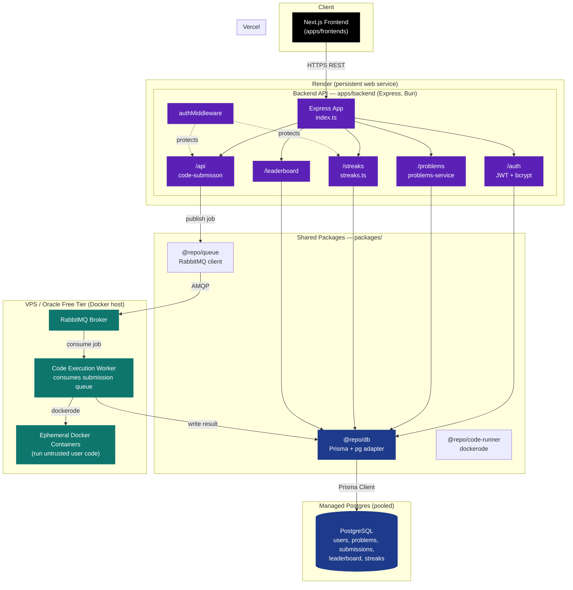

# Competitive Programming Platform

A full-stack coding practice platform — browse problems, submit solutions, get them judged against test cases in isolated Docker containers, track streaks, and compete on a leaderboard.

Built as a Turborepo monorepo with Bun.

## Architecture



### Request flow

1. **Frontend** (Next.js on Vercel) calls the backend over HTTPS.
2. **Backend** (Express on Render) handles `/auth`, `/problems`, `/leaderboard`, `/streaks` directly against Postgres via `@repo/db` (Prisma).
3. **Code submission** (`/api`) doesn't execute code inline — it publishes a job to RabbitMQ via `@repo/queue` and returns immediately.
4. A separate **worker process**, running on a VPS with Docker access, consumes the queue and uses `@repo/code-runner` (`dockerode`) to spin up an isolated container per submission, run the user's code against test cases, and write the result back to Postgres.
5. The frontend polls or re-fetches submission status once the worker finishes.

This split exists because serverless/PaaS platforms (Vercel, Render, Railway) don't expose a Docker socket to your app — only a real VM can safely run arbitrary untrusted code in containers.

## Monorepo layout

```
.
├── apps/
│   ├── backend/            # Express API (auth, problems, submissions, streaks, leaderboard)
│   └── frontends/          # Next.js app
├── packages/
│   ├── database/           # Prisma schema, generated client, @repo/db
│   ├── code-runner/        # dockerode-based sandboxed execution, @repo/code-runner
│   ├── rabbit-mq/          # AMQP client, @repo/queue
│   ├── eslint-config/
│   ├── typescript-config/
│   └── ui/                 # shared React components
├── docker-compose.yml
├── turbo.json
└── bun.lock
```

## Tech stack

| Layer | Technology |
|---|---|
| Frontend | Next.js, React, TypeScript |
| Backend API | Express, TypeScript, Bun |
| Database | PostgreSQL, Prisma 7 (`@prisma/adapter-pg`) |
| Queue | RabbitMQ (`amqplib`) |
| Code execution | Docker (`dockerode`) |
| Auth | JWT, bcrypt |
| Monorepo tooling | Turborepo, Bun workspaces |

## Deployment

| Component | Platform |
|---|---|
| Frontend (`apps/frontends`) | Vercel |
| Backend API (`apps/backend`) | Render (persistent web service) |
| Code execution worker + RabbitMQ | VPS with Docker (e.g. Oracle free tier / Hetzner) |
| PostgreSQL | Managed Postgres with a pooled connection string (e.g. Neon/Supabase) |

## Local development

```bash
# install everything from the repo root
bun install

# spin up Postgres + RabbitMQ locally
docker compose up -d

# generate Prisma client
cd packages/database && bunx prisma generate

# run all apps via Turborepo
cd ../.. && bun run dev
```

## Environment variables

Each app/package reads its own `.env`. At minimum you'll need:

```
DATABASE_URL=postgres://...?sslmode=verify-full
JWT_SECRET=...
RABBITMQ_URL=amqp://...
```